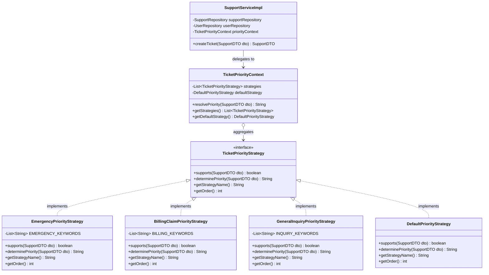

# Strategy Pattern Implementation — Customer Support Module

> **Course:** SE2030 - Software Engineering | SLIIT University  
> **Group:** MLBB2G209  
> **Module:** Customer Support Management Module  
> **Student:** Nemsith K.B.N (IT25101054)  
> **Pattern Type:** Gang of Four (GoF) Behavioral Design Pattern — **Strategy Pattern**

---

## 1. Overview & Objective

The **Strategy Pattern** is a behavioral software design pattern that enables selecting an algorithm at runtime. Instead of implementing a single algorithm directly within a class, code receives run-time instructions specifying which in a family of algorithms should be used.

In the **Customer Support Management Module**, support tickets submitted by policyholders, hospital staff, or agents vary drastically in urgency, clinical severity, and financial impact. This package implements the Strategy Pattern to dynamically calculate and assign **ticket priorities** (`HIGH`, `MEDIUM`, `LOW`) and resolution SLAs based on the ticket's subject, description, and request metadata.

---

## 2. Problem Statement & Motivation

### Prior Implementation (Before Strategy Pattern)
Originally, support ticket creation in `SupportServiceImpl` assigned a hardcoded default priority:

```java
// BEFORE: Rigid, hardcoded priority assignment
ticket.setPriority(
    supportDTO.getPriority() != null 
        ? supportDTO.getPriority() 
        : "MEDIUM"
);
```

### Limitations of the Prior Approach:
1. **Violation of the Open/Closed Principle (OCP):** Adding new prioritization criteria (e.g., identifying medical emergencies, claim disputes, VIP accounts) required editing `SupportServiceImpl` with deeply nested `if-else` or `switch` statements.
2. **Clinical & Operational Risk:** A critical ticket titled *"Emergency ICU Admission Pending Authorization"* could default to `MEDIUM` priority if the user did not manually pick `HIGH`, causing dangerous adjudication delays.
3. **Tight Coupling:** Priority calculation logic was tied directly to the database persistence layer rather than being modular and independently testable.

### Solution with Strategy Pattern:
We encapsulated each priority calculation algorithm into separate strategy classes implementing a common `TicketPriorityStrategy` interface. A `TicketPriorityContext` resolves and executes the appropriate strategy dynamically at runtime.

---

## 3. Architecture & Class Diagram

### Mermaid Class Diagram


### ASCII Class Hierarchy
```
                   +----------------------------------+
                   |     <<interface>>                |
                   |     TicketPriorityStrategy       |
                   +----------------------------------+
                   | + supports(dto): boolean         |
                   | + determinePriority(dto): String |
                   | + getStrategyName(): String      |
                   | + getOrder(): int                |
                   +----------------------------------+
                                     ▲
         +---------------------------+---------------------------+---------------------------+
         |                           |                           |                           |
+---------------------+    +---------------------+    +---------------------+    +---------------------+
| EmergencyPriority   |    | BillingClaimPriority|    | GeneralInquiry      |    | DefaultPriority     |
| Strategy (@Order 10)|    | Strategy (@Order 20)|    | Strategy (@Order 30)|    | Strategy (@Order 100|
+---------------------+    +---------------------+    +---------------------+    +---------------------+
| Keywords: ICU,      |    | Keywords: claim,    |    | Keywords: info,     |    | Fallback strategy:  |
| emergency, surgery, |    | refund, rejected,   |    | inquiry, how to,    |    | respects user input |
| critical, cardiac   |    | denied, dispute     |    | portal, question    |    | or defaults 'MEDIUM'|
| Priority: "HIGH"    |    | Priority: "HIGH"    |    | Priority: "LOW"     |    | Priority: DTO/MEDIUM|
+---------------------+    +---------------------+    +---------------------+    +---------------------+
                                     ▲
                                     | Spring List Injection
                         +------------------------+
                         | TicketPriorityContext  |
                         +------------------------+
                         | + resolvePriority(dto) |
                         +------------------------+
                                     ▲
                                     | Injected via @RequiredArgsConstructor
                         +------------------------+
                         |   SupportServiceImpl   |
                         +------------------------+
                         | + createTicket(dto)    |
                         +------------------------+
```

---

## 4. Package Components

| Class / Interface | Role in Pattern | Description |
|---|---|---|
| [`TicketPriorityStrategy`](./TicketPriorityStrategy.java) | **Strategy Interface** | Defines the contract for all priority calculation algorithms (`supports`, `determinePriority`, `getStrategyName`, `getOrder`). |
| [`EmergencyPriorityStrategy`](./EmergencyPriorityStrategy.java) | **Concrete Strategy** | Detects critical medical and emergency terms (`emergency`, `icu`, `critical`, `surgery`, `ambulance`, `cardiac`). Assigns **`HIGH`** priority (Order: 10). |
| [`BillingClaimPriorityStrategy`](./BillingClaimPriorityStrategy.java) | **Concrete Strategy** | Detects financial, billing, and claim disputes (`claim`, `refund`, `rejected`, `denied`, `dispute`, `reimbursement`). Assigns **`HIGH`** priority (Order: 20). |
| [`GeneralInquiryPriorityStrategy`](./GeneralInquiryPriorityStrategy.java) | **Concrete Strategy** | Detects general questions and portal assistance (`inquiry`, `info`, `how to`, `portal`, `question`). Assigns **`LOW`** priority (Order: 30). |
| [`DefaultPriorityStrategy`](./DefaultPriorityStrategy.java) | **Concrete Strategy** | Default fallback when no domain-specific keywords match. Respects user-provided priority if valid, or defaults to **`MEDIUM`** (Order: 100). |
| [`TicketPriorityContext`](./TicketPriorityContext.java) | **Strategy Context** | Collects all strategy beans via Spring DI, sorts them by order precedence, and evaluates the incoming ticket against candidate strategies. |

---

## 5. Runtime Execution Flow

```
User files support ticket
           │
           ▼
[POST /api/support] (SupportController)
           │
           ▼
SupportServiceImpl.createTicket(supportDTO)
           │
           ▼
TicketPriorityContext.resolvePriority(supportDTO)
           │
           ├─► 1. Check EmergencyPriorityStrategy.supports(dto)?
           │      └── YES ──► Return "HIGH" (Logged)
           │
           ├─► 2. Check BillingClaimPriorityStrategy.supports(dto)?
           │      └── YES ──► Return "HIGH" (Logged)
           │
           ├─► 3. Check GeneralInquiryPriorityStrategy.supports(dto)?
           │      └── YES ──► Return "LOW" (Logged)
           │
           └─► 4. None matched ──► DefaultPriorityStrategy.determinePriority(dto)
                  └── Return User DTO Priority or "MEDIUM" (Logged)
           │
           ▼
SupportTicket.setPriority(resolvedPriority)
           │
           ▼
Saved to MySQL Database via SupportRepository
```

---

## 6. Code Examples

### 1. Strategy Interface (`TicketPriorityStrategy.java`)
```java
public interface TicketPriorityStrategy {
    boolean supports(SupportDTO dto);
    String determinePriority(SupportDTO dto);
    String getStrategyName();
    default int getOrder() { return 100; }
}
```

### 2. Sample Concrete Strategy (`EmergencyPriorityStrategy.java`)
```java
@Component
@Order(10)
public class EmergencyPriorityStrategy implements TicketPriorityStrategy {
    private static final List<String> EMERGENCY_KEYWORDS = List.of(
        "emergency", "icu", "critical", "ambulance", "surgery",
        "life threatening", "urgent", "accident", "trauma", "cardiac"
    );

    @Override
    public boolean supports(SupportDTO dto) {
        String text = ((dto.getSubject() != null ? dto.getSubject() : "") + " " +
                (dto.getDescription() != null ? dto.getDescription() : "")).toLowerCase();
        return EMERGENCY_KEYWORDS.stream().anyMatch(text::contains);
    }

    @Override
    public String determinePriority(SupportDTO dto) {
        return "HIGH";
    }

    @Override
    public String getStrategyName() {
        return "Emergency Priority Strategy";
    }

    @Override
    public int getOrder() {
        return 10;
    }
}
```

### 3. Context (`TicketPriorityContext.java`)
```java
@Component
public class TicketPriorityContext {
    private final List<TicketPriorityStrategy> strategies;
    private final DefaultPriorityStrategy defaultStrategy;

    public TicketPriorityContext(List<TicketPriorityStrategy> strategies, DefaultPriorityStrategy defaultStrategy) {
        this.strategies = strategies.stream()
                .filter(s -> !(s instanceof DefaultPriorityStrategy))
                .sorted(Comparator.comparingInt(TicketPriorityStrategy::getOrder))
                .toList();
        this.defaultStrategy = defaultStrategy;
    }

    public String resolvePriority(SupportDTO dto) {
        for (TicketPriorityStrategy strategy : strategies) {
            if (strategy.supports(dto)) {
                log.info("[Strategy Pattern] Selected strategy '{}' -> Priority: {}",
                        strategy.getStrategyName(), strategy.determinePriority(dto));
                return strategy.determinePriority(dto);
            }
        }
        return defaultStrategy.determinePriority(dto);
    }
}
```

### 4. Client Integration (`SupportServiceImpl.java`)
```java
@Service
@RequiredArgsConstructor
public class SupportServiceImpl implements SupportService {

    private final SupportRepository supportRepository;
    private final UserRepository userRepository;
    private final TicketPriorityContext priorityContext; // Injected Context

    @Override
    public SupportDTO createTicket(SupportDTO supportDTO) {
        // ... (user lookup & initialization)

        // Dynamically resolve priority using the Strategy Pattern
        ticket.setPriority(priorityContext.resolvePriority(supportDTO));

        SupportTicket savedTicket = supportRepository.save(ticket);
        return convertToDTO(savedTicket);
    }
}
```

---

## 7. SOLID Principles Justification

| Principle | How This Implementation Complies |
|---|---|
| **Single Responsibility Principle (SRP)** | Each strategy class has one specific job: evaluating a single category of prioritization logic (medical emergency, billing dispute, general inquiry). |
| **Open/Closed Principle (OCP)** | New algorithms (e.g. VIP Customer, Hospital Network SLA) can be introduced by creating a new class implementing `TicketPriorityStrategy`. No modifications to `SupportServiceImpl` or `TicketPriorityContext` are required. |
| **Liskov Substitution Principle (LSP)** | All concrete strategies seamlessly substitute `TicketPriorityStrategy` without breaking the caller or violating expectations. |
| **Interface Segregation Principle (ISP)** | The `TicketPriorityStrategy` interface is focused and contains only the methods needed to evaluate and execute the strategy. |
| **Dependency Inversion Principle (DIP)** | `SupportServiceImpl` depends on the abstraction (`TicketPriorityContext` / `TicketPriorityStrategy`), not on concrete strategy implementations. Spring DI injects strategies automatically. |

---

## 8. How to Add a New Strategy

To add a new strategy (e.g., `VIPCustomerPriorityStrategy`):

1. Create a new class in this package implementing `TicketPriorityStrategy`:
   ```java
   @Component
   @Order(5) // Evaluated before other rules
   public class VIPCustomerPriorityStrategy implements TicketPriorityStrategy {
       @Override
       public boolean supports(SupportDTO dto) {
           return dto.getUserId() != null && isVIPUser(dto.getUserId());
       }

       @Override
       public String determinePriority(SupportDTO dto) {
           return "HIGH";
       }

       @Override
       public String getStrategyName() {
           return "VIP Customer Priority Strategy";
       }

       @Override
       public int getOrder() {
           return 5;
       }
   }
   ```
2. **That's all!** Spring will automatically discover the bean and register it in `TicketPriorityContext` without touching existing code.

---

## 9. Unit Testing & Verification

Unit tests are located in:  
`backend/src/test/java/com/mlbb2g209/healthinsurance/support/strategy/TicketPriorityStrategyTest.java`

### Test Scenarios Covered:
1. `testEmergencyStrategy`: Asserts that tickets with ICU/surgery keywords trigger `EmergencyPriorityStrategy` and yield `HIGH`.
2. `testBillingClaimStrategy`: Asserts that tickets with claim rejection/refund keywords trigger `BillingClaimPriorityStrategy` and yield `HIGH`.
3. `testGeneralInquiryStrategy`: Asserts that questions/portal inquiries trigger `GeneralInquiryPriorityStrategy` and yield `LOW`.
4. `testDefaultStrategyWithUserPriority`: Asserts that arbitrary subjects respect the user's explicit priority selection.
5. `testDefaultStrategyFallbackToMedium`: Asserts that null priority inputs safely fallback to `MEDIUM`.

### Running Tests:
```bash
cd backend
.\mvnw test -Dtest=TicketPriorityStrategyTest
```

**Results:**
```text
[INFO] Running com.mlbb2g209.healthinsurance.support.strategy.TicketPriorityStrategyTest
[INFO] Tests run: 5, Failures: 0, Errors: 0, Skipped: 0, Time elapsed: 0.208 s
[INFO] BUILD SUCCESS
```
